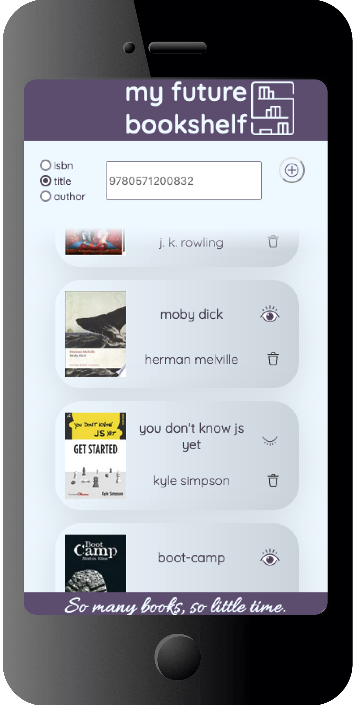

Read a book-review and plan to get the book at some point? A friend recommended a book and you want to remember it? **my future bookshelf** lets you keep track. Search for any book via ISBN, Author or Title and add it to your pile. Read the book but haven't bought it yet? Mark it as "read". Once the book is on your real bookshelf, easily delete it. 

## Background
This App was developed as the Capstone-Project during the Web Development Bootcamp at [neue fische](https://www.neuefische.de). 

The following tools and libraries were used in the making: 

* [React](https://reactjs.org/)
* [Next.js](https://nextjs.org/)
* [Styled Components](https://styled-components.com/)
* [Google Books API](https://developers.google.com/books)
* [Prettier](https://prettier.io/)
* [React-Toastify](https://www.npmjs.com/package/react-toastify)
## Have a look

  
     
## Try it out
Try out [my future bookshelf](https://my-future-bookshelf.vercel.app/). 

This app is optimized for mobile usage, so please switch your browser to responsive mode (iPhone 6/7/8).
